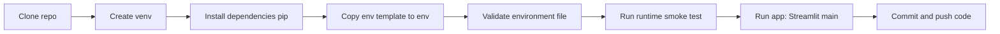

# 🧑‍💻 Development Guide — AGIcyborg

%% Developer Workflow
_Standard flow for local setup and iteration._



%% Prereqs
- Python 3.11 (recommended)
- macOS: `xcode-select --install` (for build tools)
- (Optional) Homebrew for developer utilities

%% First-Time Setup
```bash
python3 -m venv .venv
source .venv/bin/activate
pip install -r requirements.txt  # if present
# or install incrementally:
pip install streamlit supabase python-dotenv pandas cryptography openai matplotlib
```

%% Environment
Copy the template, then set real values locally:
```bash
cp .env.template .env
```

%% Quick Smoke Tests
```bash
# Validate env
python -m tools.validate_env

# Runtime test (license + decrypt + call)
python -m tools.test_runtime_call

# Run UI
streamlit run main.py
```

%% Git Hygiene
- Secrets never in git: `.env`, `tools/keys/*`, `tools/license.jwt`, `.venv/`, `tools/runtime.bin.enc`.
- Pre-commit hook validates `.env` before commit.
- Use SSH for GitHub remotes.
