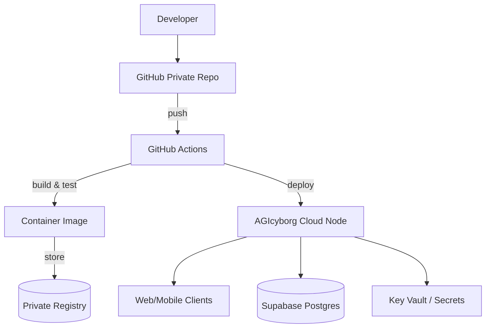

# 🛠️ Runbook — AGIcyborg

## CI/CD & Deployment (Preview)

## Daily
- `python -m tools.validate_env`
- `python -m tools.test_runtime_call`
- `streamlit run main.py` → quick manual test

## Troubleshooting
### `.env` issues
- Use `tools/validate_env.py` to detect truncated keys like `RL=`, `EY=`, `B64=`.
- Normalize file endings (LF), remove stray spaces around `=`.

### Supabase
- Health page should show counts; if not:
  - Check `SUPABASE_URL` / `SUPABASE_KEY`.
  - Verify network access.
  - Inspect `public` schema tables.

### OpenAI
- Ensure `OPENAI_API_KEY` is set.
- Toggle “AI Mentor Mode” off to use curated insights only.

### Runtime
- License expired: reissue `AGI_LIC_B64` with new `exp`.
- Decrypt error: confirm `AGI_KEY_B64` and integrity of `runtime.bin.enc`.

## Maintenance
- Rotate keys periodically.
- Backup local `.env` and keys to a secure vault (outside repo).
- Keep `requirements.txt` pinned and updated intentionally.
