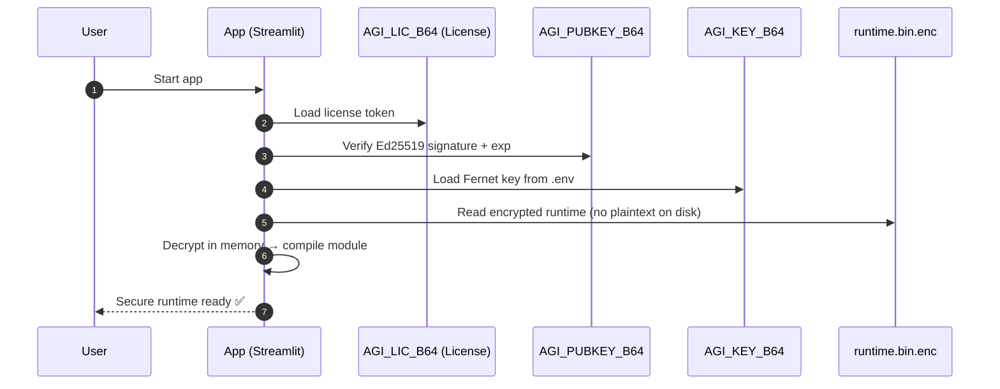

# 🔐 Security — AGIcyborg

## Security Lifecycle
_Startup validation and in-memory runtime loading._

## Principles
- Least-privilege by default.
- Secrets local; no secrets in Git.
- Encrypted runtime, verified license, in-memory decrypt.
- Auditable environment via health page and logs (local).

## Secrets Handling
- `.env` is **local-only** and ignored by git.
- Keys:
  - `AGI_PUBKEY_B64`: 32-byte Ed25519 (base64url).
  - `AGI_KEY_B64`: Fernet key (44-char base64).
  - `AGI_LIC_B64`: signed license (header.payload.signature).
- Validate before runs: `python -m tools.validate_env`.

## Runtime Protection
- `tools/inmem_loader.py`:
  - Verifies license signature (Ed25519) and `exp`.
  - Optional HW-bind via fingerprint.
  - Decrypts `tools/runtime.bin.enc` in-memory (no plaintext on disk).

## Supabase
- Restrict **Row Level Security** (RLS) as needed.
- Use service roles only in trusted environments.
- Limit anon key to least-privileged operations in app.

## Incident Basics
- Rotate `AGI_KEY_B64` if exposure suspected.
- Re-issue license (`AGI_LIC_B64`) with new `exp`/`hw` binding.
- Invalidate leaked tokens at provider portals.
